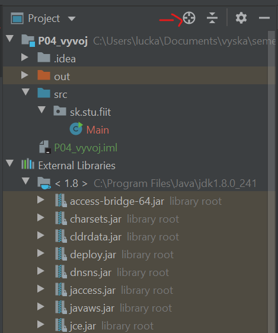

### Github link VAVA
https://github.com/miroslav-reiter/VAVA-JAVA

### Java documentation
https://docs.oracle.com/en/java/javase/index.html

### Skratky
| keys                 | meaning                       |
| -------------------- | ----------------------------- |
| sout + tab           | System.out.println("");       |
| shift + enter        | jump to new line              |
| psvm + tab           | new private static void main  |
| ctrl + space         | act. list                     |
| alt + ins            | generate constr.              |
| pr + tab             | private                       |
| ctrl + /             | comment line                  |
| ctrl + shift + f10   | run this file                 |
| ctrl + shift + arrow | move line                     |
| ctrl + c             | copy curr line                |
| ctrl + d             | duplicate curr line           |
| soutv + tab          | print + variable              |
| alt + enter          | solve problems - e.g. imports |
| ctrl + Q             | quick documentation           |
| ctrl + alt + L       | reformat code                 |
| ctrl + alt + O       | remove unused imports         |
| ctrl + click         | open documentation            |
| shift + f6           | refactor -> rename            |
| ctrl + H             | browse type hierarchy         |

- platform manager intellij - File | Project Structure | Platform Settings | SDKs
- zmenit conf file v intellij jdk default - File | Other Settings | Structure for New Projects | Project | Project language level - ASI?
- edit configuration | change main class
- VM options:
  - -ea (enable assertion)
  - -da (disable assertion)
  - showversion
  - version
  - client
- ked das podjebnik, stale plati cislo, napr 15_000
- auto import - File | Settings | Editor | General | Autoimport | Check options:
  - Add unambiguous imports on the fly
  - Optimize imports on the fly
- navigator v intellij   

### Principy dzavy
- static - nevytvara objekty
- final - nemenitelne, konstanta
  - viem pouzit vo switch
- overload (pretazenie) - rozny parameter pri rovnakom nazve metody
- assert false - nepusti dalej v kode
  - na testy dobre, treba enableovat
  - asercia by defalut blokovana

### GUI v intellij jak netbeans
- new project bez template, zrobit balik
- new | Swing UI DEsigner | Create GUI Form | urcite create bound class
- nahadzat veci do formularu
- v triede alt+insert -> zrobi form spustitelny

- clean and build -> jar aplikacia v netbeans
  - v intellij: - NEVIM CI FUNGUJE
  - https://www.jetbrains.com/help/idea/compiling-applications.html#run_packaged_jar
  - File | Project Structure | Artifacts
    - + | Jar | From modules with dependencies
    - select main class, extract to the target JAR
  - ptm select JAR a treba buildnut

### CMD
chcp 65001 - zmena kodovania do utf-8

### Zadanie 1
- do 5. cvicenia
